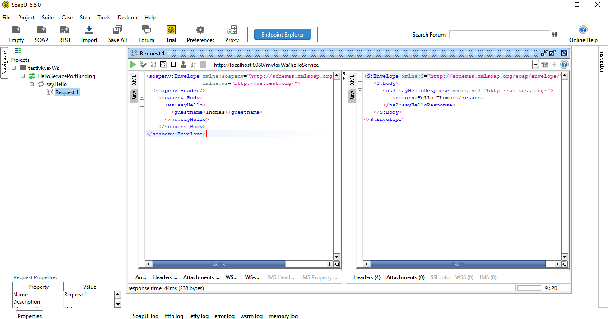

SOAP webservice

url of wsdl : http://localhost:8080/myJaxWs/helloService?wsdl  
 
request : 
--- 
<soapenv:Envelope xmlns:soapenv="http://schemas.xmlsoap.org/soap/envelope/" xmlns:ws="http://ws.test.org/">  
  &lt;soapenv:Header/>  
    &lt;soapenv:Body>  
      &lt;ws:sayHello>  
        &lt;guestname>Thomas&lt;/guestname>  
      &lt;/ws:sayHello>  
    &lt;/soapenv:Body>  
&lt;/soapenv:Envelope>  
--- 
 
Here is a screenshot of the webservice being addressed through the software SOAPUI 
